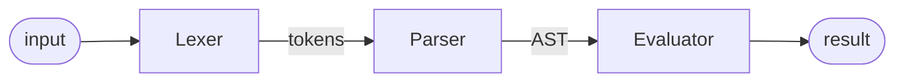

# DiceRoller

A D&D dice roller written in Java.

## Implemented parser type

The interpreter is built on top of a [recursive descent parser](https://www.wikiwand.com/en/articles/Recursive_descent_parser)
that uses [Pratt Parsing technique](https://en.wikipedia.org/wiki/Operator-precedence_parser#Pratt_parsing) for expression
precedence handling.

## Implemented features

- Roll all D&D dice types (**d4**, **d6**, **d8**, **d10**, **d12**, **d20**, **d100**) and show the roll result:

    ```
    > 2d4
        2d4
        [2d4] = [2,3] = 5
    5

    > 3d8
        3d8
        [3d8] = [8,8,1] = 17
    17

    > 1d20
        1d20
        [1d20] = [6] = 6
    6
    ```

- All common operations between both integers and dices (addition, subtraction, multiplication, division):

    ```
    > 1+2+3
        ((1 + 2) + 3)
    6

    > 3-2
        (3 - 2)
    1

    > 3*2
        (3 * 2)
    6

    > 2d8+2
        (2d8 + 2)
        [2d8] = [3,6] = 9
    11

    > 1d20+5
        (1d20 + 5)
        [1d20] = [6] = 6
    11
    ```

- Common operators precedence of an expression:

    ```
    > 2+3*2
        (2 + (3 * 2))
    8

    > 5+6/2
        (5 + (6 / 2))
    8

    > 1d20+2*4
        (1d20 + (2 * 4))
        [1d20] = [19] = 19
    27
    ```

- Parentheses to change the default operator precedence of an expression:

    ```
    > (2+3)*2
        ((2 + 3) * 2)
    10

    > (2+6)/2
        ((2 + 6) / 2)
    4

    > (1d20+2)/2
        ((1d20 + 2) / 2)
        [1d20] = [6] = 6
    4
    ```

- Roll D&D dices and sum all separate rolls with the result of an expression:

    ```
    > 3d8[2]
        3d8[2]
        [3d8] = [8,2,7] + [2] = 10,4,9
    10,4,9

    > 2d4[2+3]
        2d4[(2 + 3)]
        [2d4] = [1,2] + [5] = 6,7
    6,7
    ```

## Random number generator (RNG)

This project uses a cryptographically strong random number generator to roll dices.

The implementation used for the RNG is [SecureRandom](https://docs.oracle.com/en/java/javase/17/docs/api/java.base/java/security/SecureRandom.html).

## Help message

```
Usage: <jar file name> [-hV] [-ml | -mp | -me]
A D&D dice roller written in Java
  -h, --help               Show this help message and exit.
      -me, --mode-evaluator
                           Enable evaluator mode [default]
      -ml, --mode-lexer    Enable lexer mode
      -mp, --mode-parser   Enable parser mode
  -V, --version            Print version information and exit.
```

## Execution modes

- **Lexer mode**: enable only the Lexer module. It converts a sequence of characters into a sequence of lexical tokens
(Lexical Analysis). A lexical token or token is a string with an assigned and thus identified meaning.

- **Parser mode**: enable only the Lexer and the Parser modules. Uses the stream of tokens to check the syntactic
structure of the input and generate the Abstract Syntax Tree (Syntax Analysis). The implemented parser is a
Recursive Descent Parser that uses the Pratt Parsing technique to handle operator precedence.

- **Evaluator mode**: enable Lexer, Parser and Evaluator modules. Interprets the AST (Abstract Syntax
Tree) on the fly (without compiling it) and produces the result of the input expression.

## Modules and interactions



## Build JAR using just command
```bash
user@host:~$ just package
```

## Build JAR using Maven
```bash
user@host:~$ mvn package
```

## Run JAR file
```bash
user@host:~$ java -jar DiceRoller-1.0-SNAPSHOT.jar
```

To exit the program type **q** or use the **Ctrl+C**.

## References
The really useful book [Writing an Interpreter in Go](https://interpreterbook.com/) written by Thorsten Ball.

Some other articles that I used:

- [The Right Way to Use SecureRandom](https://tersesystems.com/blog/2015/12/17/the-right-way-to-use-securerandom/)

- [Pratt Parsers: Expression Parsing Made Easy](https://journal.stuffwithstuff.com/2011/03/19/pratt-parsers-expression-parsing-made-easy/)
